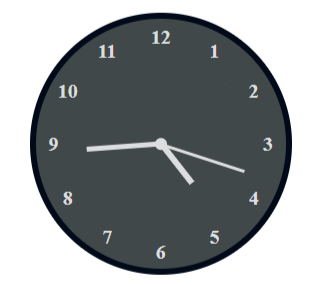

# react-simple-clock

This repository contains simple analog clock to be used in React applications. You can either use the live clock or set 
your given time to see a stationary clock. You can check the live demo [here](https://codesandbox.io/s/late-frog-1nxilo).

## Installation

### NPM
```sh
npm install react-simple-clock
```
### YARN
```sh
yarn add react-simple-clock
```

## Usage

### Fixed clock with provided time
```js
import React from 'react'
import Clock from 'react-simple-clock'

const MyApp = () => <Clock hourValue={2} minuteValue={20} />

export default MyApp
```


### Live styled clock with number marked hour
```js
import React from 'react'
import Clock from 'react-simple-clock'

const MyApp = () => <Clock live={true} hourMarkFormat="number" className="your-class" />

export default MyApp
```
```css
.your-class {
	border-width: 5px !important;
	border-color: rgb(6, 100, 240) !important;
	background-color: rgba(212, 242, 251, 0.753);
}
```


### Live styled clock in dark mode
```js
import React from 'react'
import Clock from 'react-simple-clock'

const MyApp = () => <Clock live={true} hourMarkFormat="number" className="your-class" mode="dark" />

export default MyApp
```
```css
.your-class {
	border-width: 5px !important;
	border-color: rgb(0, 10, 25) !important;
	background-color: rgba(2, 12, 15, 0.753);
}
```


## Properties

| Property         | Type     | Default Value | Description                                                                                                                    |
|------------------|----------|---------------|--------------------------------------------------------------------------------------------------------------------------------|
| `hourValue`      | number   | null          | The hour to show as output. No need to use if you want to show a live clock.                                                   |
| `minuteValue`    | number   | null          | The minute to show as output. No need to use if you want to show a live clock.                                                 |
| `size`           | number   | 200           | Size of the clock in `px`.                                                                                                     |
| `hourMarkFormat` | string   | null          | In which formate the hour marks to be displayed. If you want to display number then use `number` or use `roman` to show roman. |
| `className`      | string   | null          | Your customized styled class name. Try to use it for `background-color`, `border-color`, `background-width` etc.               |
| `live`           | boolean  | false         | If `true` then a live clock with current time & second hand is displayed.                                                      |
| `mode`           | string   | light         | If the mode is `light` then the theme is a light mode one otherwise use `dark` to display a dark theme.                        |

## To run in development

```bash
npm run dev
```

## To run tests

```bash
npm test
```

or

```bash
npm run watch
```

## License

MIT © [alim1496](https://github.com/alim1496)
